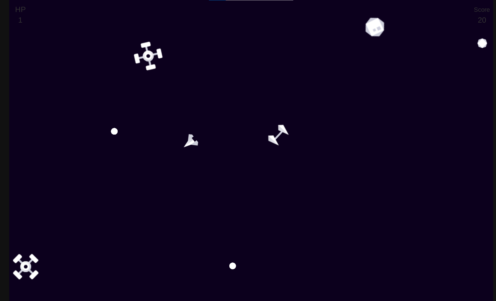

# Asteroids

## Game preview :movie_camera:
[  ](https://simmer.io/@Krecker/asteroids "Play it online")

### Links
[  ](https://simmer.io/@Krecker/asteroids "Play it online")

## Gameplay :video_game:
[  ](https://simmer.io/@Krecker/asteroids "Play it online")

### How to control on PC
Use the A + D to rotate the spaceship.

Use the W + D to move the spaceship.

Use Space to shoot.

### Goal

Score as many points as possible.

## Getting Started :traffic_light:
This project requires Unity3D (2020.3.8f1+) to build and run. Clone this repository and open the root folder in Unity.

## Libraries and Resources Used :books:

* [Kenney Graphics](https://www.kenney.nl/assets/simple-space)

## Game Features :checkered_flag:
- [X] Many types of enemies
- [X] Different types of movement
- [X] The player stops smoothly
- [X] Shooting, delay between shots
- [X] Bullets are pre-generated and taken from the queue, returned to the same place
- [X] Bullets return to the pool after a while if they do not reach the target
- [X] Objects in collision cause damage to other objects
- [X] Adapter and facade for movement created
- [X] Tests for movement and rotations are written
- [X] Auto-generation of opponents from 8 sides

## ToDo :bookmark_tabs:
- [X] Release the game
- [X] Create README file for this game
- [ ] Make input controller for Android
